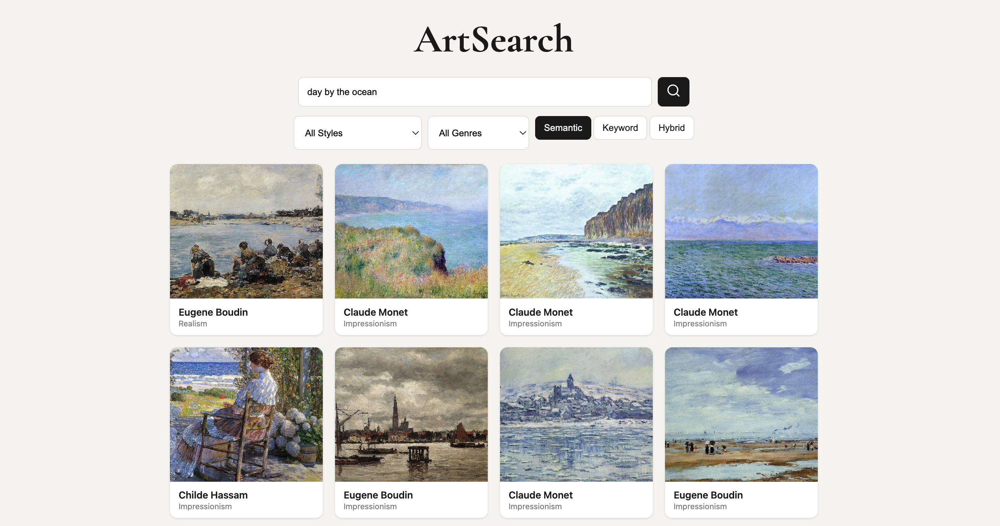

# Semantic Search Engine

### Features

- Backend REST API - Implemented with Django

- Semantic, Keyword, and Hybrid Search - Uses OpenAI CLIP model and Meilisearch

- Docker Containerization - Allows fast implementation on personal machine

### Description

Semantic search is typically implemented through text. Models like word2vec and GloVe convert words to vectors that live in an embedding space. These models are trained to learn the relationships between words in their vocabulary and embed similiar words close together in the embedding space. Due to the invention of vision transformers, we are now able to create embeddings for images as well.

In this project, I present a semantic search engine that uses OpenAI's CLIP model to embed artwork from the Wikiart dataset and words in the same embedding space. This allows the user to describe a painting and receive artworks that capture a similiar meaning.

Though semantic search is capable of conveying the meaning between artworks and text well, it performs poorly at keyword understanding. For example, typing "Monet" may produce some paintings by Claude Monet and other works in the Impressionism style, but does not fully succeed in retrieving pieces by Monet. As such, I also implemented keyword and hybrid search. The keyword search uses Meilisearch, while the hybrid search combines the scores from the semantic and keyword searches into a single ranking using Reciprocal Rank Fusion.

## Examples

